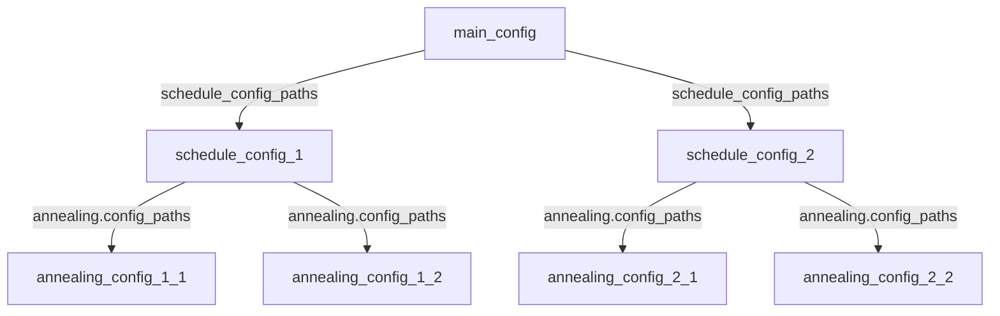
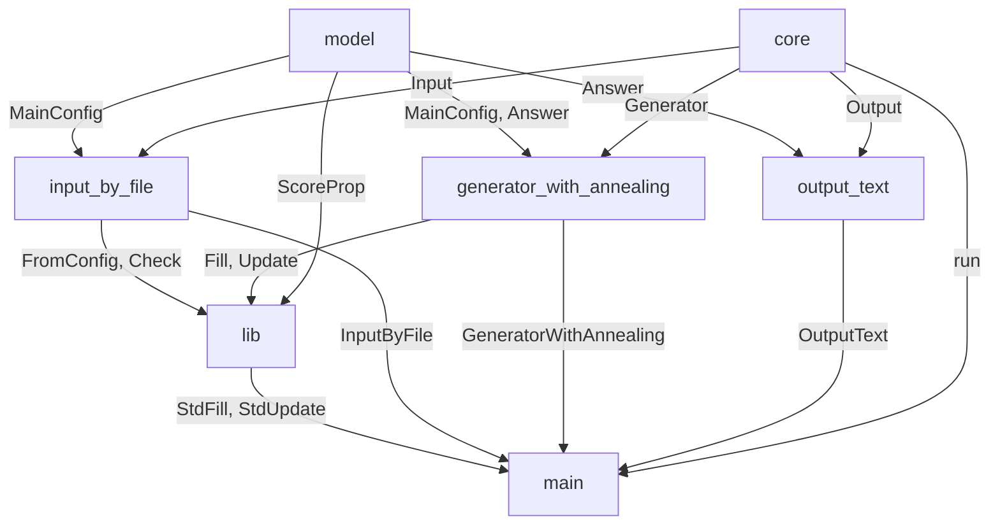

# kinmu

## 概要

看護職員の勤務表を自動生成するツールです。
設定ファイルに条件を入力し、プログラムを実行することで条件に合った勤務表を生成します。
アルゴリズムは焼きなまし法(Simulated Annealing法)を採用しています。

### ナーススケジューリング問題について

看護職員の勤務表を生成する問題はナーススケジューリング問題(Nurse Scheduling Problem, NSP)と呼ばれます。
この問題の難しさは、勤務日ごとにスケジュールが独立していない点にあります。
例えば、以下のような制約があります。

- 夜勤の「入り」(夜勤に入る日)と「明け」(夜勤明けの日)はセットで管理する必要がある。
- 夜勤明けには必ず休みを設定する必要がある。
- 曜日によって必要人数が異なる。

このような特徴により、通常のスケジューリング問題ソルバーでは対応が難しく、NSP専用のソルバーを開発する必要がありました。

### このツールの強み

既存のNSPソルバーにはいくつか課題があります。国内では多くのツールが提供されていますが、無料で利用できるものは少なく、無料であってもオープンソースでないものや、設定が複雑なものが多いです。
このツールでは以下の点を強みとしています。

- オープンソースで自由にカスタマイズ可能

   本ツールはオープンソースで提供されています。気に入らない部分や改良したい点があれば、ソースコードを自由に編集して利用できます。

- シンプルな設定方式

   GUIではなく、設定ファイル(configファイル)による入力に特化しています。これにより、複雑な操作を省き、簡潔かつ効率的にツールを利用できます。

- 簡単かつ柔軟なアルゴリズム

   本ツールは焼きなまし法を用いています。このアルゴリズムでは、ランダムに勤務表に変更を加え、改善が見られればその変更を採用する操作を繰り返します。
   これにより以下の利点があります。

   - 最適解が存在しない場合でも解を出力可能

      制約が厳しい場合でも、妥協案を提示できます。

   - 小規模かつ条件が厳しい現場にも対応可能

      必要に応じて柔軟に条件を調整できます。

### ライセンス

MITライセンスをリポジトリ全体に適用しています。
このため商用利用、ソースコードの改変、二次配布等を許可しています。

### リポジトリ

https://github.com/unsharot/kinmu_rs

## 実行方法

### 実行ファイルをダウンロードする場合

ビルドせずに実行ファイル(Windowsの場合exeファイル)をダウンロードする場合、以下の手順に従ってください。

1. 実行ファイル`kinmu.exe`を任意のフォルダ`A`に入れる (`A/kinmu.exe`という状態)
2. ディレクトリ`A/config`を作成
3. メインの設定ファイル`A/config/config.toml`を作成
4. `A/config/config.toml`で指定した次の設定ファイル(schedule_config)に必要事項を記入
5. schedule_configで指定したファイルで指定したannealing_configに必要事項を記入
6. ターミナルを開き、`A`へ移動する
7. `./kinmu.exe`をターミナルで実行

exeファイルを実行する際、デフォルトでメインconfigとして`example/main_config.toml`が読み込まれますが、読み込むconfigを指定することもできます。
以下のように引数に`-l`あるいは`--load`オプションからファイルのパスを指定することで、読み込むファイルを指定できます。
絶対パスと現在のディレクトリからの相対パスの両方に対応しています。
モードを切り替えて使いたい場合にご利用ください。

```sh
# 指定する場合、-lオプションからメインconfigのパスを指定
# config/hoge/config.tomlをメインとする場合
./kinmu.exe -l config/hoge/config.toml
```

```sh
# 指定しない場合、付属のexample/main_config.tomlが実行される
./kinmu.exe
```

また、`-o`あるいは`--output`オプションから出力先パスを指定できます。
指定した場合、標準出力の代わりに指定ファイルに結果がテキスト出力されます。
Windowsの場合、出力先の指定にパイプラインを用いると文字化けやカラーコードが残る場合があるため、こちらの機能をご利用ください。

```sh
# 指定する場合、-oオプションからテキストファイルのパスを指定
# output.txtを出力先とする場合
./kinmu.exe -o output.txt
```

### ソースコードをダウンロードする場合

ソースコードをビルドして実行します。
RustのビルドシステムCargoが必要です。
お使いのOS向けの実行ファイルが配布されていない場合や、ソースコードを改造したい場合、この方法を使ってください。

まず、以下のコマンドでリポジトリをクローンしてください。

```sh
git clone https://github.com/unsharot/kinmu_rs
```

バージョンを指定したい場合、続けて下のようにコマンドを実行して、バージョンを変更してください。
(v2.1.0の場合)

```sh
git checkout v2.1.0
```

#### ビルドしない場合

リリースビルドでの実行の場合、ターミナルで以下のコマンドを実行してください。
`-r`は`--release`のエイリアスで、なしだと実行速度が遅くなります。

```sh
cargo run -r
```

```sh
# 読み込むファイルを指定する場合
cargo run -r -- -l config/hoge/config.toml
```

#### ビルドする場合

リリースビルドでのビルドを以下のコマンドで行ってください。

```sh
cargo build -r
```

`./target/release/kinmu` (Linux)
または
`./target/release/kinmu.exe` (Windows)
が生成されるので、「実行ファイルをダウンロードする場合」同様に実行してください。

## 設定方法
各設定は以下のように呼び出されます。
main_configはデフォルトではconfig/config.tomlですが、引数から指定することも可能です。



設定ファイルはtoml形式に従うため、`#`を用いてコメントが記述可能です。
また、リスト中の改行やスペースの数は問題にならないため、うまく使ってコメントをつけておくと便利です。

```toml
# これはコメントです。
# この行は無視されます。
#スペースはなくても問題ありません。

# これは正しく読み込まれます。
hoge = [
   1,2,  3,
   3, # 途中で改行が挟んであっても問題ありません。

4, # こんなのもOKです。
]

# これはエラーが出ます。
foo =
1

# 正しくはこうです。
foo = 1
```

各ファイルの設定方法については、[各ファイルの設定方法](docs/index.md)と付属の`example`フォルダを参照してください。

## 改造するには

ソースコードを編集する方法と、一部をライブラリとして利用する方法があります。

一部をライブラリとして利用する場合、src/main.rsを参考にして、必要なモジュールを以下のようにuseしてください。

```rust
use kinmu::output_text::OutputText;
```

モジュールは多層構造になっています。
traitを利用し、頻繁に変わる可能性のあるモジュールほど下層に配置しています。
上の層のtraitを下の層のinstanceで実装しています。

以下の表のような層構造になっています。

| module                                               | trait                    | instance                                        |
| ---------------------------------------------------- | ------------------------ | ----------------------------------------------- |
| core                                                 | Input, Generator, Output |                                                 |
| model                                                | ScoreProp                | MainConfig, Answer                              |
| input_by_file, generator_with_annealing, output_text |                          | InputByFile, GeneratorWithAnnealing, OutputText |
| lib                                                  |                          | StdScoreProp, Shift                             |


モジュール同士の依存関係は下図のようになっています。



独自の入力、生成、出力方法を使用したい場合はkinmu::core::Input, Generator, Outputをそれぞれ実装してください。

職場に特有の考慮事項があり、既存のスコアで評価不可能な場合、ScorePropを実装する新たなenum型を定義してください。
既存のStdScorePropと併用したい場合、kinmu::macros::ScorePropのderiveマクロを用いてenumを拡張できます。

```rust
use kinmu::lib::StdScoreProp;
use kinmu::macros::ScoreProp;
use crate::your_module::YourSP;

#[derive(ScoreProp)]
// ScorePropに用いる型引数を指定します。
#[score_prop(<Shift, ShiftState, DayState>)]
enum NewScoreProp {
   Std(StdScoreProp),
   // YourSPはScorePropを実装している必要があります。
   New(YourSP),
}
```

## お問い合わせ

### 質問について

ご質問がある場合、Issueを立ててください。
質問の内容が必要に応じてREADMEや仕様に反映されることがあります。

### 不具合修正や仕様変更の要望について

不具合の修正や仕様変更のリクエストもIssueを通じてお寄せください。

### 開発への貢献について

開発へのご協力は大歓迎です！
Pull Request(PR)をお送りいただければ、レビューさせていただきます。
また、コードに関して気になる点がありましたら、Issueを立ててご共有いただけると嬉しいです。
皆さまのご意見や知見はとても勉強になります。
