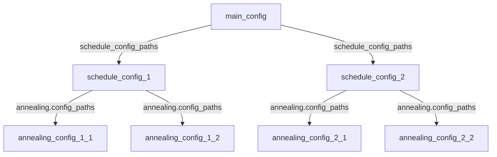

# kinmu

## 概要

看護職員の勤務表を自動生成するツールです。
設定ファイルに条件を入力し、プログラムを実行することで条件に合った勤務表を生成します。
アルゴリズムは焼きなまし法(Simulated Annealing法)を採用しています。

### ナーススケジューリング問題について

看護職員の勤務表を生成する問題はナーススケジューリング問題(Nurse Scheduling Problem, NSP)と呼ばれます。
この問題の難しさは、勤務日ごとにスケジュールが独立していない点にあります。
例えば、以下のような制約があります。

- 夜勤の「入り」(夜勤に入る日)と「明け」(夜勤明けの日)はセットで管理する必要がある。
- 夜勤明けには必ず休みを設定する必要がある。
- 曜日によって必要人数が異なる。

このような特徴により、通常のスケジューリング問題ソルバーでは対応が難しく、NSP専用のソルバーを開発する必要がありました。

### このツールの強み

既存のNSPソルバーにはいくつか課題があります。国内では多くのツールが提供されていますが、無料で利用できるものは少なく、無料であってもオープンソースでないものや、設定が複雑なものが多いです。
このツールでは以下の点を強みとしています。

- オープンソースで自由にカスタマイズ可能

   本ツールはオープンソースで提供されています。気に入らない部分や改良したい点があれば、ソースコードを自由に編集して利用できます。

- シンプルな設定方式

   GUIではなく、設定ファイル(configファイル)による入力に特化しています。これにより、複雑な操作を省き、簡潔かつ効率的にツールを利用できます。

- 簡単かつ柔軟なアルゴリズム

   本ツールは焼きなまし法を用いています。このアルゴリズムでは、ランダムに勤務表に変更を加え、改善が見られればその変更を採用する操作を繰り返します。
   これにより以下の利点があります。

   - 最適解が存在しない場合でも解を出力可能

      制約が厳しい場合でも、妥協案を提示できます。

   - 小規模かつ条件が厳しい現場にも対応可能

      必要に応じて柔軟に条件を調整できます。

### ライセンス

MITライセンスをリポジトリ全体に適用しています。
このため商用利用、ソースコードの改変、二次配布等を許可しています。

### リポジトリ

https://github.com/unsharot/kinmu_rs

## 実行方法

### 実行ファイルをダウンロードする場合

ビルドせずに実行ファイル(Windowsの場合exeファイル)をダウンロードする場合、以下の手順に従ってください。

1. 実行ファイル`kinmu.exe`を任意のフォルダ`A`に入れる (`A/kinmu.exe`という状態)
2. ディレクトリ`A/config`を作成
3. メインの設定ファイル`A/config/config.toml`を作成
4. `A/config/config.toml`で指定した次の設定ファイル(schedule_config)に必要事項を記入
5. schedule_configで指定したファイルで指定したannealing_configに必要事項を記入
6. ターミナルを開き、`A`へ移動する
7. `./kinmu.exe`をターミナルで実行

exeファイルを実行する際、デフォルトでメインconfigとして`example/main_config.toml`が読み込まれますが、読み込むconfigを指定することもできます。
以下のように引数にファイルのパスを指定することで、読み込むファイルを指定することができます。
絶対パスと現在のディレクトリからの相対パスの両方に対応しています。
モードを切り替えて使いたい場合にご利用ください。

```sh
./kinmu.exe config/hoge/config.toml
```

```sh
# 指定しない場合、付属のexample/main_config.tomlが実行される
./kinmu.exe
```

### ソースコードをダウンロードする場合

ソースコードをビルドして実行します。
RustのビルドシステムCargoが必要です。
お使いのOS向けの実行ファイルが配布されていない場合や、ソースコードを改造したい場合、この方法を使ってください。

まず、以下のコマンドでリポジトリをクローンしてください。

```sh
git clone https://github.com/unsharot/kinmu_rs
```

バージョンを指定したい場合、続けて下のようにコマンドを実行して、バージョンを変更してください。
(v2.1.0の場合)

```sh
git checkout v2.1.0
```

#### ビルドしない場合

リリースビルドでの実行の場合、ターミナルで以下のコマンドを実行してください。
`-r`は`--release`のエイリアスで、なしだと実行速度が遅くなります。

```sh
cargo run -r
```

#### ビルドする場合

リリースビルドでのビルドを以下のコマンドで行ってください。

```sh
cargo build -r
```

`./target/release/kinmu` (Linux)
または
`./target/release/kinmu.exe` (Windows)
が生成されるので、「実行ファイルをダウンロードする場合」同様に実行してください。

## 設定方法
各設定は以下のように呼び出されます。
main_configはデフォルトではconfig/config.tomlですが、引数から指定することも可能です。



設定ファイルはtoml形式に従うため、`#`を用いてコメントが記述可能です。
また、リスト中の改行やスペースの数は問題にならないため、うまく使ってコメントをつけておくと便利です。

```toml
# これはコメントです。
# この行は無視されます。

# これは正しく読み込まれます。
hoge = [
   1,2,  3,
   3, #途中で改行が挟んであっても問題ありません。

4, # こんなのもOKです。
]

# これはエラーが出ます。
foo =
1

# 正しくはこうです。
foo = 1
```

各ファイルの設定方法については、以下の説明と付属の`example`フォルダを参照してください。

### main_config
呼び出すファイルを設定します。

#### schedule_config_paths
勤務表のconfigのパスを列挙します。
絶対パスと現在のディレクトリからの相対パスの両方に対応しています。

```toml
schedule_config_paths = [
   "./config/configW.toml",
   "./config/configK.toml",
]
```

#### thread_count
焼きなましに用いるスレッド数を指定します。
結果もここで指定した数だけ表示されます。
CPUの論理プロセッサ数を指定すると高速に動作します。
未記入の場合、値は1と認識され実行されます。

```toml
thread_count = 8
```

### schedule_config
勤務表に使う基本的な値の設定です。

#### staff
スタッフに関する設定のグループです。
以下のタグのもと設定してください。
順不同です。

```toml
[staff]
```

##### attributes
職員ごとのパラメータ名を設定します。
日本語でも可です。

```toml
[staff]
attributes = [
   "Leader",
   "KDayCount",
   "IDayCount",
   "ODayCount",
   "HDayCount",
]
```
```toml
[staff]
attributes = [
   "リーダー",
   "公休数",
   "夜勤数",
   "遅番数",
   "早番数",
]
```

##### list
職員の能力、attributesで指定したパラメータ、名前を列挙します。
コメントで項目名を記しておくと便利です。

```toml
list = [
   {name = "職員A", attributes = [0, 8, 3, -1, -1]},
   {name = "職員B", attributes = [1, 9, 6,  0,  0]},
]
```

```toml
list = [
   #        名前                  リーダー 公休   夜勤   遅番  早番  番号
   {name = "職員A", attributes = [0,      8,    3,    -1,   -1]}, #0
   {name = "職員B", attributes = [1,      9,    6,     0,    0]}, #1
]
```

##### ng_list
特定の職員同士が夜勤で同じ日の勤務にならないようにするための設定です。
職員リストで上から0,1,2..と番号を振っていき、その番号で指定します。
行ごとに必ず改行を挟んで設定してください。

```toml
ng_list = [
   {from = 0, to = 1},
   {from = 5, to = 1},
]
```

##### count
職員の数を指定します。
職員リストの長さより小さい数が指定された場合、職員リストの上からその数だけカウントされ、余剰分は無視されます。

```toml
count = 12
```

#### day
日付に関する設定のグループです。
以下のタグのもと設定してください。
順不同です。

```toml
[day]
```

##### day_count
勤務表の日数を指定します。
30日の月で、バッファー日数を3日に指定している場合、30日+バッファー日数3日 = 33日として指定してください。

```toml
day_count = 33
```

##### states
日数で指定した日数分の日ごとの状態を設定します。状態は以下の通りです。

- W: WeekDay 平日
- H: Holiday 休日
- F: Bath フロ
- 2: Bath2 フロ2
- G: Weight 体重測定

```toml
states = "W2WHHWFW2GHHWFW2WHHWFW2WHHWFW2WHH"
```

##### buffer_count
バッファーの日数を指定します。
バッファーというのは、先月の終わり３日分など、考慮するべき日数です。
3日分を考慮する際は3を設定してください。

```toml
buffer_count = 3
```

##### requested_schedule
希望として出された勤務表を指定します。
横軸が日、縦軸が職員です。
すなわち、行が職員ごとの希望、列が日ごとの希望となります。
シフトは以下の通りです。

- N: 日勤
- K: 公休
- I: 夜勤入り
- A: 夜勤明け
- O: 遅番
- H: 早番
- Y: 有給
- U: 未定

希望を絶対として焼きなましを行います。
未定の場所以外は絶対条件としてカウントされ、出力で変化していることはありません。
また、未定(U)はスペース( )での入力も可能です。
バッファーが重要でない場合、Uとしても出力で変化することはありません。
コメントで職員名と日付を記しておくと便利です。

```toml
requested_schedule = [
   "AKNUUUUUUUUUUIAKYUUUUUUUUIAKUUUUU",
   "KHIAKUUUUUUUUUUUIAKYUUUUUUUUUUUUU",
   "OIAKUUUUUUUUUUUUUUUUUUUIAKYUUUUUU",
   "NOKKUUUUUUUUUUUUUUUUUUUUUUUUUUUUY",
   "IAKUUUUUUUUUUUUUUYUUUUUUUKUUUUUUU",
   "HYNUUUUUUUUUUUUUKUUUUYUUUUUUUUUUU",
   "KNOUUUUUUUUUUUUUUUUUUUYUUUUUUUUUU",
   "KNIAIAKKIAKUUUUUUUUUUUUUUUUUUUYUU",
   "KNHUUUUUUUUUUUUUUUUUUUUUUUUUUUUUU",
   "IAKUUUUUUUUUUUIAKUUUUUUUUUUUUUUUU",
   "UUUKKUUUUYKKUUUUUKKUUUUUKKUUUUUKK",
   "UUUKKUUUUUKKUUUUUKKKUUUKKKUUUUUKK",
]
```

```toml
requested_schedule = [
   #W2WHHWFW2GHHWFW2WHHWFW2WHHWFW2WHH
   #000123456789012345678901234567890
   "   KKNNNNNKKNNNNNKKNNNNNKKNNNNNKK", #職員A
   "NIAKKK    KKYK                   ", #職員B
   "AKN KK                           ", #職員C
   "NNIAK                        IAKY", #職員D
   "KNN       KK                     ", #職員E
   "KNN                              ", #職員F
   "KNN                  YKK         ", #職員G
   "IAK               KK             ", #職員H
   "UUUKKYYYYYKYYYYYYKKYYYYYKYYYYYYKK", #職員I
   "NKN      K                K      ", #職員J
   "NIAK                             ", #職員K
   "NNN             K   K     K      ", #職員L
   "NON    KK       KK               ", #職員M
   "ONK                              ", #職員N
   "AKO        K             K       ", #職員O
   "KNK                              ", #職員P
]
```

##### attributes
日付ごとのパラメータ名と値を設定します。
パラメータの数は任意です。
値はスペースで区切ります。

```toml
attributes = [
   {name = "IStaffCount", values = [0, 0, 0, 1, 1, 1, 1, 1, 2, 1, 1, 1, 1, 1, 1, 1, 2, 1, 1, 1, 1, 1, 2, 2, 1, 2, 1, 1, 1, 1, 1, 1, 1, 2, 1, 1, 2]},
   {name = "OStaffCount", values = [1, 1, 1, 1, 1, 1, 1, 1, 1, 1, 1, 1, 1, 1, 1, 1, 1, 1, 1, 1, 1, 1, 1, 1, 1, 1, 1, 1, 1, 1, 1, 1, 1, 1, 1, 1, 1]},
]
```

#### fill
fillに関する設定のグループです。
以下のタグのもと設定してください。
順不同です。

```toml
[fill]
```

##### function
焼きなましの前に未定(U)の場所をうめるための関数を指定します。
以下の関数があります。

- fill1: それぞれの枠をランダムな要素で埋めます。
- fill2: 夜勤の数と公休の数を守り、入りと明けの連続やその後の休みも加味して埋めます。

```toml
function = "fill2"
```

##### seed
fillの乱数に用いるシード値を指定します。
型はu64で、最小値は0、最大値はu64の上限で、18446744073709551615です。
未記入の場合、シード値は実行のたびにランダムで選ばれ実行されます。
再現性のあるテストがしたいときは固定し、実際に使う場合は未記入で実行するのが良いでしょう。

```toml
# 多くの場合、シード値の指定は不要です。
# コメントアウトしておくといいでしょう。
# seed = 0
```

```toml
seed = 53
```

#### annealing
焼きなましに関する設定のグループです。
以下のタグのもと設定してください。
順不同です。

```toml
[annealing]
```

##### config_paths
焼きなましの設定ファイルのパスを指定します。
焼きなましはここで列挙した順に行われます。
絶対パスと現在のディレクトリからの相対パスの両方に対応しています。

```toml
config_paths = [
   "./config/anconfigW/randomWalk.toml",
   "./config/anconfigW/W1.toml",
   "./config/anconfigW/W2.toml",
]
```

#### result
結果に関する設定のグループです。
以下のタグのもと設定してください。
順不同です。

```toml
[result]
```

##### score_functions
焼きなまし終了後、結果を表示する際に用いるスコアを列挙します。
スコアの名前と、そのスコアに用いるパラメータを指定します。
順不同です。スコアは以下のとおりです。

| Prop名                       | 引数の型                                    | 説明                                                                                                    |
| :--------------------------- | :------------------------------------------ | :------------------------------------------------------------------------------------------------------ |
| PatternGeneral               | (Cond, [[Shift]], Score)                    | 指定したシフトパターンが出現した場合のペナルティを指定                                                  |
| PatternFixed                 | (Cond, [Shift], Score)                      | 指定したシフトパターンが出現した場合のペナルティを指定                                                  |
| PatternGeneralAny            | (Cond, [[Shift]], Score)                    | 指定したシフトパターンが出現する職員ごとにペナルティを指定                                              |
| PatternFixedAny              | (Cond, [Shift], Score)                      | 指定したシフトパターンが出現する職員ごとにペナルティを指定                                              |
| Streak                       | (Cond, [Shift], i32, Score)                 | 指定したシフトが指定した回数連続した場合のペナルティを指定                                              |
| ShiftsBalance                | (Cond, Shift, Shift, Score)                 | 指定した2つのシフトのバランスが悪い場合のペナルティを指定                                               |
| ShiftHalfBalance             | (Cond, Shift, Score)                        | 指定したシフトが指定範囲の前半と後半でバランスが取れていない場合のペナルティを指定                      |
| ShiftDirPriority             | (Cond, Shift, Score)                        | 指定したシフトが指定範囲の前後どちらにあるほうが良いか指定 指定スコアが正なら前を優先、負なら後ろを優先 |
| DayCountRegardStaffAttribute | (Cond, Shift, StaffAttributeName, Score)    | 職員ごとの指定したパラメータと指定したシフトの数の差によるペナルティを指定                              |
| StaffCountRegardDayAttribute | (Cond, Shift, DayAttributeName, Score)      | 日付ごとの指定したパラメータと指定したシフトの数の差によるペナルティを指定                              |
| StaffCount                   | (Cond, Shift, i32, Score)                   | 指定した値と指定したシフトの人数の差によるペナルティを指定                                              |
| StaffCountWithPremise        | (Cond, Shift, i32, Cond, Shift, i32, Score) | 指定したシフトの人数を満たした日付に対して、指定した値と指定したシフトの人数の差によるペナルティを指定  |
| NGPair                       | (Cond, Shift, Score)                        | NGに指定されたペアが指定したシフトで同じ日になる場合のペナルティを指定                                  |
| NoSamePair                   | (Cond, i32, Shift, Score)                   | 指定したシフトで同じペアが指定回数以上ある場合のペナルティを指定                                        |

型の詳細は以下の通り

| 型名      | 説明                             | 例                                             |
| :-------- | :------------------------------- | :--------------------------------------------- |
| Cond      | スコアを適用する勤務表の枠の条件 | And (DayExceptBuffer (), ParticularDayState B) |
| Shift     | シフト N,K,I,A,O,H,Y,D,U         | N                                              |
| [Shift]   | シフトのリスト                   | [N, O, H]                                      |
| [[Shift]] | シフトのリストのリスト           | [[N], [K, Y]]                                  |
| Score     | スコア 実数                      | -100.3                                         |
| i32       | 整数                             | -3                                             |
| usize     | 非負整数                         | 4                                              |
| DayState  | 曜日 W,H,B,2,M                   | B                                              |

Condの詳細は以下の通り

| 種類               | 引数の型                  | 説明                                                               |
| :----------------- | :------------------------ | :----------------------------------------------------------------- |
| Every              | ()                        | すべての枠を有効とする                                             |
| Or                 | (Cond, Cond)              | 指定した2つのCondのどちらかを満たしていれば有効とする              |
| And                | (Cond, Cond)              | 指定した2つのCondの両方を満たしていれば有効とする                  |
| Not                | Cond                      | 指定した条件を満たしていなければ有効とする                         |
| DayExceptBuffer    | ()                        | バッファーでないなら有効                                           |
| DayInRange         | (usize, usize)            | 指定した範囲の日付でないなら有効 日数はバッファーから0,1,2..と続く |
| ParticularDayState | DayState                  | 指定の曜日なら有効                                                 |
| BeforeDayState     | DayState                  | 指定の曜日の前日なら有効                                           |
| ParticularDay      | usize                     | 指定の日付のみ有効                                                 |
| StaffInRange       | (usize, usize)            | 指定した範囲のスタッフなら有効                                     |
| StaffWithAttribute | (StaffAttributeName, i32) | 指定した職員ごとのパラメータが指定した整数であるスタッフなら有効   |
| ParticularStaff    | usize                     | 指定した番号のスタッフなら有効                                     |

```toml
score_functions = [
   "PatternGeneral (Every (), [[I], [N,O,H,I,K,Y]], 1000)",
   "PatternGeneral (Every (), [[A], [N,O,H,I,A]], 1000)",
   "PatternFixed (Every (), [K,I], 100)",
   "PatternFixed (Every (), [Y,I], 100)",
   "PatternGeneral (Every (), [[K,Y],[N,O,H],[I]], 10)",
   "PatternGeneral (Every (), [[N,O,H],[N,O,H],[I]], -300)",
   "PatternFixed (Every (), [O,N], 100)",
   "PatternFixed (Every (), [N,H], 1000)",
   "PatternFixed (Every (), [O,H], 2000)",
   "Streak (Every (), [N,O,H,I,A], 4, 200)",
   "Streak (Every (), [N,O,H,I,A], 5, 1000)",
   "Streak (Every (), [N,O,H,I,A], 6, 4000)",
   "Streak (Every (), [N,O,H,I,A], 7, 10000)",
   "NGPair (DayExceptBuffer (), I, 1000)",
   "Streak (Every (), [K,Y], 2, -100)",
   "Need2Holidays (Every (), [K,Y], 1000)",
   "Need2Holidays (DayExceptBuffer (), [K,Y], 1000)",
   "ShiftsBalance (DayExceptBuffer (), O, H, 3)",
   "ShiftHalfBalance (DayExceptBuffer (), I, 10)",
   "ShiftHalfBalance (DayExceptBuffer (), O, 3)",
   "ShiftHalfBalance (DayExceptBuffer (), H, 3)",
   "DayCountRegardStaffAttribute (DayExceptBuffer (), K, KDayCount, 10)",
   "DayCountRegardStaffAttribute (DayExceptBuffer (), I, IDayCount, 10)",
   "DayCountRegardStaffAttribute (DayExceptBuffer (), O, ODayCount, 100)",
   "DayCountRegardStaffAttribute (DayExceptBuffer (), H, HDayCount, 100)",
   "StaffCountRegardDayAttribute (DayExceptBuffer (), I, IStaffCount, 10)",
   "StaffCount (And (DayExceptBuffer (), ParticularDayState B), N, 4, 5)",
   "StaffCount (And (DayExceptBuffer (), ParticularDayState 2), N, 2, 5)",
   "StaffCount (And (DayExceptBuffer (), ParticularDayState W), N, 2, 5)",
   "StaffCount (And (DayExceptBuffer (), ParticularDayState H), N, 2, 5)",
   "StaffCount (And (DayExceptBuffer (), ParticularDayState M), N, 2, 5)",
   "StaffCount (DayExceptBuffer (), O, 1, 100)",
   "StaffCount (DayExceptBuffer (), H, 1, 100)",
   "StaffCountWithPremise (DayExceptBuffer (), I, 1, And (DayExceptBuffer (), StaffWithAttribute (ベテラン, 1)), I, 1, 70)",
   "StaffCount (And (BeforeDayState B, DayExceptBuffer ()), I, 1, 30)",
   "StaffCount (DayExceptBuffer (), U, 0, 100000)",
   "NoSamePair (DayExceptBuffer (), 3, I, 1000)",
   "NoSamePair (DayExceptBuffer (), 2, I, 500)",
]
```

### annealing_config
焼きなまし法で用いるパラメータを設定します。

#### step_count
焼きなましのステップ数を指定します。

```toml
step_count = 20000
```

#### seed
焼きなまし法の更新関数に用いる乱数のシード値を指定します。
型はu64で、最小値は0、最大値はu64の上限で、18446744073709551615です。
未記入の場合、シード値は実行のたびにランダムで選ばれ実行されます。
再現性のあるテストがしたいときは固定し、実際に使う場合は未記入で実行するのが良いでしょう。

```toml
# 多くの場合、シード値の指定は不要です。
# コメントアウトしておくといいでしょう。
# seed = 0
```

```toml
seed = 6554
```

#### score_functions
焼きなましに用いるスコアとパラメータを指定します。
記述方法は勤務表のconfigのスコアと同じです

#### update_function
焼きなましの更新に用いる更新関数を指定します。
更新関数は以下の通りです。

- update4: N,O,HをN,O,Hのうちのランダムな要素に入れ替えます。
- update5: 夜勤と公休をランダムに移動します。夜勤の数や公休の数は維持されます。

```toml
update_function = "update5"
```

#### temp
焼きなましの最高温度と最高温度を実数で指定します。
序盤に許容するスコアの悪化幅を指定するとよいでしょう。

```toml
temp = {max = 25, min = 0}
```

## 改造するには

CLIの出力形式を変更したかったり、GUIを実装したかったりする場合はsrc/io内のコードを

職場に特有の考慮事項があり、既存のスコアで評価不可能な場合、kinmu_libを

アルゴリズムを焼きなまし法から山登り法などに変更したい場合、annealingを

それぞれ編集してください。

## お問い合わせ

### 質問について

ご質問がある場合、Issueを立ててください。
質問の内容が必要に応じてREADMEや仕様に反映されることがあります。

### 不具合修正や仕様変更の要望について

不具合の修正や仕様変更のリクエストもIssueを通じてお寄せください。

### 開発への貢献について

開発へのご協力は大歓迎です！
Pull Request(PR)をお送りいただければ、レビューさせていただきます。
また、コードに関して気になる点がありましたら、Issueを立ててご共有いただけると嬉しいです。
皆さまのご意見や知見はとても勉強になります。
