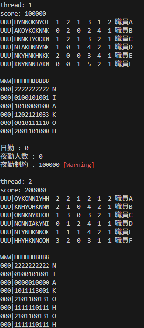

# kinmu

## 概要

看護職員の勤務表を自動生成するツールです。
設定ファイルに条件を入力し、プログラムを実行することで条件に合った勤務表を生成します。
アルゴリズムは焼きなまし法(Simulated Annealing法)を採用しています。

### このツールの強み

- 無料

   無償提供しています。

- ローカルで実行可能

   個人情報をサーバーに送る必要はありません。

- オーブンソース

   気に入らない部分や改良したい点があれば、ソースコードを自由に編集して利用できます。

- テキストベース

   複雑な操作を省き、簡潔かつ効率的にツールを利用できます。

- 非線形な条件に対応可能

   あいまいな条件を要求できます。

- 妥協案の提示が可能

   全ての条件を満たせなくても、解が出力されます。

### 問題の想定規模

付属の`example/real_case`にある例（職員12名、30日分のシフト）程度を想定しています。
職員数と日数に対して、計算時間はほぼ線形に増加します。
この例では40万ステップの焼きなましで作者の環境における実行時間は約30秒です。

本ツールはローカル環境で実行することを前提としており、実行時間はお使いのコンピュータの性能に依存します。

### 作者の環境

- OS: Windows
- CPU: Intel Core i7-8700
- メモリ: 16 GB

一昔前のコンピュータです。
最近のものであればさらに速く計算できるでしょう。

WindowsおよびUbuntuでの動作を確認済みです。
本ツールはRustで実装しているため、ビルドすればmacOSでも動作する可能性がありますが、現時点では未確認です。

### ライセンス

MITライセンスをリポジトリ全体に適用しています。
このため商用利用、ソースコードの改変、二次配布等を許可しています。

### リポジトリ

https://github.com/unsharot/kinmu_rs

## 実行方法

詳細は[ドキュメント](docs/index.md)を参照してください

### 実行ファイルをダウンロードする場合

ビルドせずに実行ファイル(Windowsの場合exeファイル)をダウンロードする場合、以下の手順に従ってください。

1. 実行ファイル`kinmu.exe`を任意のフォルダ`A`に入れる (`A/kinmu.exe`という状態)
2. ディレクトリ`A/config`を作成
3. メインの設定ファイル`A/config/config.toml`を作成
4. `A/config/config.toml`で指定した次の設定ファイル(schedule_config)に必要事項を記入
5. schedule_configで指定したファイルで指定したannealing_configに必要事項を記入
6. ターミナルを開き、`A`へ移動する
7. `./kinmu.exe`をターミナルで実行

exeファイルを実行する際、デフォルトでメインconfigとして`example/main_config.toml`が読み込まれますが、読み込むconfigを指定することもできます。
以下のように引数に`-l`あるいは`--load`オプションからファイルのパスを指定することで、読み込むファイルを指定できます。
絶対パスと現在のディレクトリからの相対パスの両方に対応しています。
モードを切り替えて使いたい場合にご利用ください。

```sh
# 指定する場合、-lオプションからメインconfigのパスを指定
# config/hoge/config.tomlをメインとする場合
./kinmu.exe -l config/hoge/config.toml
```

```sh
# 指定しない場合、付属のexample/main_config.tomlが実行される
./kinmu.exe
```

そのまま実行すると、ターミナルに下の画像のように出力されます。



また、`-o`あるいは`--output`オプションから出力先パスを指定できます。
指定した場合、標準出力の代わりに指定ファイルに結果がテキスト出力されます。
Windowsの場合、出力先の指定にパイプラインを用いると文字化けやカラーコードが残る場合があるため、こちらの機能をご利用ください。

```sh
# 指定する場合、-oオプションからテキストファイルのパスを指定
# output.txtを出力先とする場合
./kinmu.exe -o output.txt
```

`--html`オプションで実行すると、HTMLとして出力できます。`-o`オプションと併用できます。
HTMLの出力では、tableを用いて出力されます。結果を印刷したい場合に活用してください。

```sh
# output.htmlにhtmlを出力
# 出力されたファイルはブラウザで開く
./kinmu.exe --html -o output.html
```

`./kinmu.exe -l .\example\real_case\main_config.toml --html -o .\example\real_case\result.html`
を実行し、生成されたファイルを開くと下の画像のように表示されます。


### ソースコードをダウンロードする場合

ソースコードをビルドして実行します。
RustのビルドシステムCargoが必要です。
お使いのOS向けの実行ファイルが配布されていない場合や、ソースコードを改造したい場合、この方法を使ってください。

まず、以下のコマンドでリポジトリをクローンしてください。

```sh
git clone https://github.com/unsharot/kinmu_rs
```

バージョンを指定したい場合、続けて下のようにコマンドを実行して、バージョンを変更してください。
(v2.1.0の場合)

```sh
git checkout v2.1.0
```

#### ビルドしない場合

リリースビルドでの実行の場合、ターミナルで以下のコマンドを実行してください。
`-r`は`--release`のエイリアスで、なしだと実行速度が遅くなります。

```sh
cargo run -r
```

```sh
# 読み込むファイルを指定する場合
cargo run -r -- -l config/hoge/config.toml
```

#### ビルドする場合

リリースビルドでのビルドを以下のコマンドで行ってください。

```sh
cargo build -r
```

`./target/release/kinmu` (Linux)
または
`./target/release/kinmu.exe` (Windows)
が生成されるので、「実行ファイルをダウンロードする場合」同様に実行してください。

## 設定方法
各設定は以下のように呼び出されます。
main_configはデフォルトではconfig/config.tomlですが、引数から指定することも可能です。


設定ファイルはtoml形式に従うため、`#`を用いてコメントが記述可能です。
また、リスト中の改行やスペースの数は問題にならないため、うまく使ってコメントをつけておくと便利です。

```toml
# これはコメントです。
# この行は無視されます。
#スペースはなくても問題ありません。

# これは正しく読み込まれます。
hoge = [
   1,2,  3,
   3, # 途中で改行が挟んであっても問題ありません。

4, # こんなのもOKです。
]

# これはエラーが出ます。
foo =
1

# 正しくはこうです。
foo = 1
```

各ファイルの設定方法については、[各ファイルの設定方法](docs/index.md)と付属の`example`フォルダを参照してください。

## お問い合わせ

質問、バグの報告、機能のご要望、ご不便に感じている点など、どんなことでもお気軽にお知らせください。
以下の方法でお問い合わせいただけます。


### GitHub Issue

不具合の報告や機能追加のご要望は、Issueを作成していただくとスムーズに対応できます。
質問などもこちらでしていただくと、他の利用者とも情報を共有できるためおすすめです。

### お問い合わせフォーム(Google form)

GitHubアカウントをお持ちでない方や、匿名・非公開でお問い合わせを希望される方は、以下のフォームをご利用ください。

https://forms.gle/S8quep5dtCRjfB8G6

## 開発への貢献について

開発へのご協力は大歓迎です！
Pull Request(PR)をお送りいただければ、こちらでレビューさせていただきます。
また、コードに関して気になる点がありましたら、Issueを立てて共有していただけると嬉しいです。
皆さまのご意見や知見は非常に参考になります。
