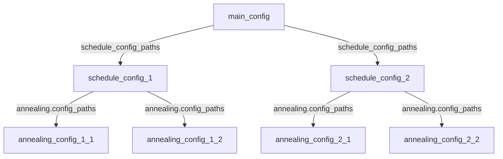

# 設定方法

各設定は以下のように呼び出されます。
main_configはデフォルトでは`example/simple_case/main_config.toml`ですが、引数から指定することも可能です。

### [TOMLファイルの書き方](how_to_toml/index.md)
設定ファイルの書き方の説明です。
設定ファイルは全てここで説明する文法に従います。

### [main_config](main_config/index.md)
呼び出すファイルを設定します。

### [schedule_config](schedule_config/index.md)
勤務表に使う基本的な値の設定です。

### [annealing_config](annealing_config/index.md)
焼きなまし法で用いるパラメータを設定します。
