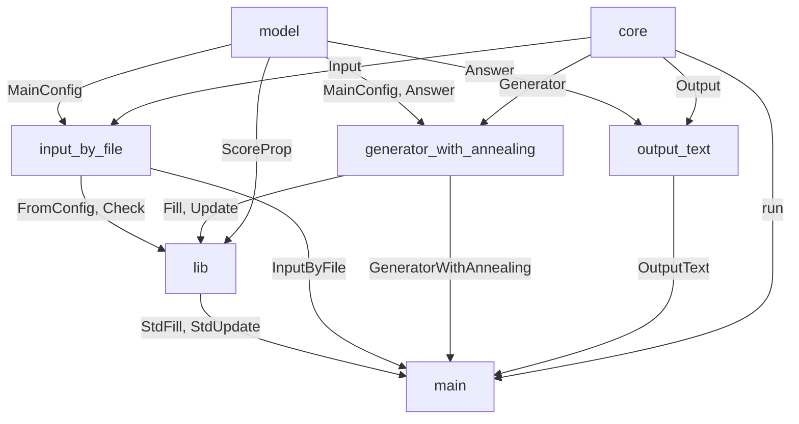

## 改造するには

ソースコードを編集する方法と、一部をライブラリとして利用する方法があります。

一部をライブラリとして利用する場合、src/main.rsを参考にして、必要なモジュールを以下のようにuseしてください。

```rust
use kinmu::output_text::OutputText;
```

モジュールは多層構造になっています。
traitを利用し、頻繁に変わる可能性のあるモジュールほど下層に配置しています。
上の層のtraitを下の層のinstanceで実装しています。

以下の表のような層構造になっています。

| module                                               | trait                    | instance                                        |
| ---------------------------------------------------- | ------------------------ | ----------------------------------------------- |
| core                                                 | Input, Generator, Output |                                                 |
| model                                                | ScoreProp                | MainConfig, Answer                              |
| input_by_file, generator_with_annealing, output_text |                          | InputByFile, GeneratorWithAnnealing, OutputText |
| lib                                                  |                          | StdScoreProp, Shift                             |


モジュール同士の依存関係は下図のようになっています。



独自の入力、生成、出力方法を使用したい場合はkinmu::core::Input, Generator, Outputをそれぞれ実装してください。

職場に特有の考慮事項があり、既存のスコアで評価不可能な場合、ScorePropを実装する新たなenum型を定義してください。
既存のStdScorePropと併用したい場合、kinmu::macros::ScorePropのderiveマクロを用いてenumを拡張できます。

```rust
use kinmu::lib::StdScoreProp;
use kinmu::macros::ScoreProp;
use crate::your_module::YourSP;

#[derive(ScoreProp)]
// ScorePropに用いる型引数を指定
#[score_prop(<Shift, ShiftState, DayState>)]
enum NewScoreProp {
   Std(StdScoreProp),
   // YourSPはScorePropを実装している必要がある
   New(YourSP),
}
```
